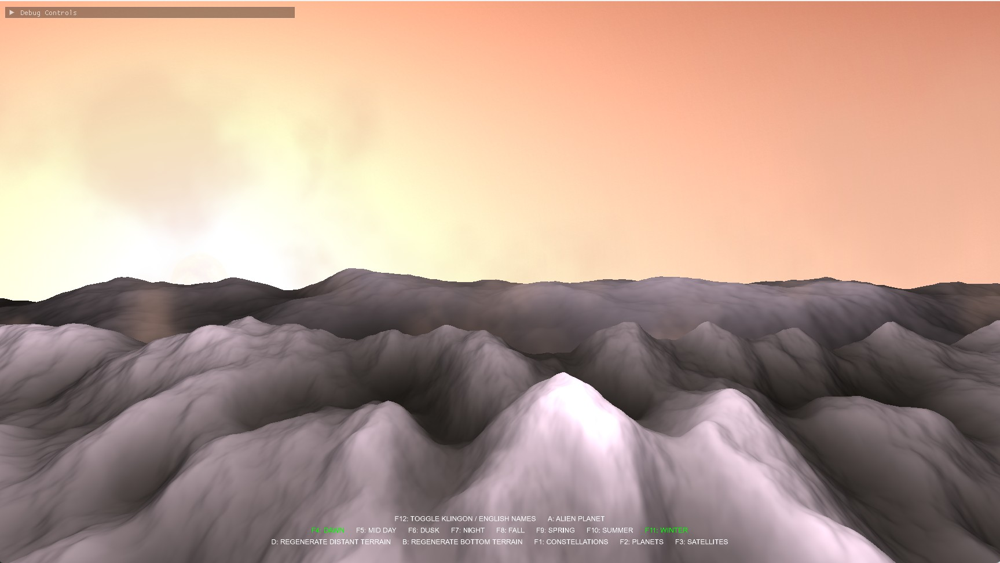
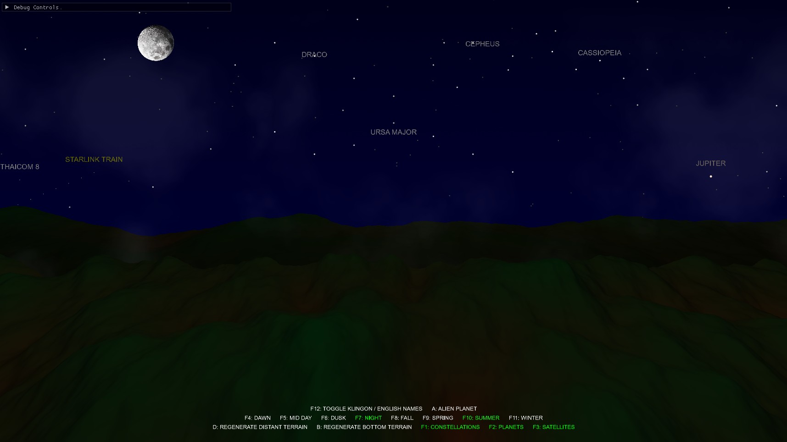
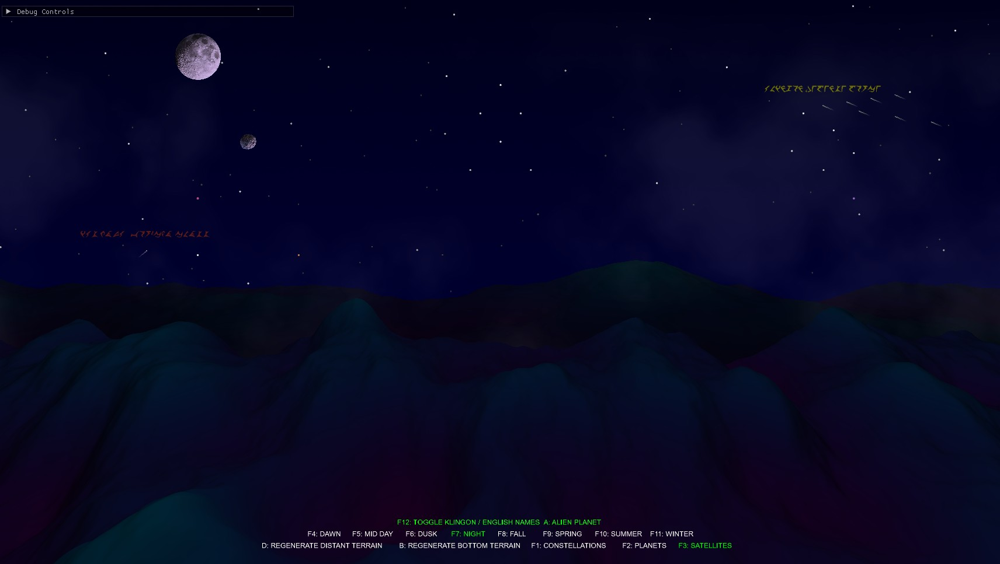

# Celestials

Celestials is a test project designed to experiment with multi-platform game development using C++17, SDL3, and OpenGL. It serves as a sandbox for testing cross-platform compatibility, build systems, and rendering techniques on Windows and Linux. This project was created with the assistance of Grok, an AI developed by xAI, to streamline development and debugging.

**Note**: This project is not planned for further development, as it was primarily a testbed for a future game release.  It may still include artficats from the game that is being worked on in parallel (though I tried to scrub most of the other game contents out).  The C++17 code still needs to be refined and cleaned up.  This version is just a functional draft that may simply be used for educational purposes.

**Repository URL**: [https://github.com/TEK-Nemesis/Celestials](https://github.com/TEK-Nemesis/Celestials)





## Project Overview

Celestials offers a dynamic 3D environment where you can change the time of day, season, and even switch to alien scenes. The Earth/Milky Way night scene features over 50 real satellites, including the Starlink train and the International Space Station (ISS). The alien night scene replaces these with 50+ sci-fi starships, complete with tactical formations and smoke/propulsion trails. The project includes numerous real constellations (north, east, west, south views) with planets and shooting stars. Random 3D terrains are generated using Perlin noise heightmaps, and shaders are utilized for elements like the sky and sun.

- **Purpose**: Test and validate multi-platform code for game development.
- **Technologies**:
  - C++17
  - SDL3 (with SDL3_ttf, SDL3_image)
  - OpenGL
  - Libraries: libnoise, nlohmann/json, GLM, GLEW, Box2D, ImGui
- **Build System**: CMake
- **Platforms**: Windows, Linux
- **License**: MIT License (see [LICENSE](#license) section)

## Attributions

- **sun.png**: Created by Love Mandala, sourced from [Vecteezy](https://www.vecteezy.com).
- **moon.png**: Created by Ovidiu Timplaru.
- **alien_planet.png**: Created by linearterra, sourced from [Vecteezy](https://www.vecteezy.com).
- **klingon_piqad.ttf**: Kaiserzharkhan is the creator of the Klingon font used in this project.

## Prerequisites

### Windows

- **Visual Studio 2022 Community Edition**:
  - Download for free from [Microsoft Visual Studio Downloads](https://visualstudio.microsoft.com/vs/community/).
  - Ensure the "Desktop development with C++" workload is installed.
- **CMake** (version 3.15 or higher), included with Visual Studio or installed separately.
- **Git** for cloning the repository and fetching dependencies.
- Ensure the following are available in your environment:
  - Visual C++ Redistributables (included with Visual Studio).
  - DirectX Runtime (for SDL3 dependencies).

### Linux

- **Ubuntu 22.04 LTS** or a compatible distribution (e.g., Linux Mint based on Ubuntu 22.04).
- **Build Tools**:

  ```
  sudo apt update
  sudo apt install -y build-essential cmake git
  ```

- **Dependencies**:
  - Install the required development libraries for OpenGL and other dependencies:
    ```
    sudo apt install -y libgl1-mesa-dev libglu1-mesa-dev \
        libfreetype6-dev libpng-dev libjpeg-dev zlib1g-dev \
        libx11-dev libxext-dev libxrandr-dev libxinerama-dev libxcursor-dev libxi-dev
    ```
  - **SDL3 Note**: SDL3, SDL3_ttf, and SDL3_image packages are not typically available in Ubuntu 22.04 LTS repositories because SDL3 is a relatively new version. You will likely need to build them from source. Follow the steps in the "Building SDL3 from Source on Linux" section below to install SDL3, SDL3_ttf, and SDL3_image.

## Cloning the Repository

### Downloading the Project

To download the Celestials project, clone the repository from GitHub:

```
git clone https://github.com/TEK-Nemesis/Celestials.git
cd Celestials
```

Alternatively, you can download a ZIP file of the repository:
- Go to [https://github.com/TEK-Nemesis/Celestials](https://github.com/TEK-Nemesis/Celestials).
- Click the green `Code` button and select `Download ZIP`.
- Extract the ZIP file to your desired location and navigate to the project directory:
  ```
  cd <extracted-folder>/Celestials
  ```

## Building on Windows

### Using Visual Studio

1. **Generate Build Files**:

   - **Recommended**: Use the provided `build_vs2022.bat` script to automatically generate a Visual Studio 2022 solution. This script sets up both Debug and Release configurations and ensures all dependencies are correctly configured. Run:

     ```
     build_vs2022.bat
     ```
     This will generate a solution file (`Celestials.sln`) in the project root directory. Open it in Visual Studio 2022:

     ```
     Celestials.sln
     ```
     While using the batch file is not strictly necessary, it is highly recommended to simplify the setup process.

   - **Manual Setup** (if not using the batch file):
     - Open the project folder in Visual Studio 2022 (`File > Open > Folder`).
     - Visual Studio will automatically detect the `CMakeLists.txt` and prompt you to generate the CMake cache. If not, run:

       ```
       cd out\build\x64-Debug
       cmake ../../.. -G "Ninja"
       cd ..\x64-Release
       cmake ../../.. -G "Ninja"
       ```
     - This generates build files in `out\build\x64-Debug` and `out\build\x64-Release`.

2. **Build the Project**:

   - If using the solution generated by `build_vs2022.bat`, build both configurations in Visual Studio:
     - Select `Debug` or `Release` from the configuration dropdown.
     - Build the solution (`Build > Build Solution` or `F5` to build and run).
   - Alternatively, build from the command line:
     - Debug:

       ```
       cd out\build\x64-Debug
       cmake --build . --config Debug
       ```
     - Release:

       ```
       cd out\build\x64-Release
       cmake --build . --config Release
       ```

3. **Run the Game**:

   - The executable, DLLs, and resources will be in:
     - Debug: `out\x64-Debug`
     - Release: `out\x64-Release`
   - Run the game from Visual Studio (set `Celestials` as the startup project) or directly:

     ```
     out\x64-Debug\Celestials.exe
     out\x64-Release\Celestials.exe
     ```

### Notes for Windows

- Ensure the `thirdparty\sdl3_ttf` directory contains the precompiled binaries:
  - `lib\x64\SDL3_ttf.lib` and `lib\x64\SDL3_ttf.dll` for Debug.
  - `win32-x64\SDL3_ttf.dll` for Release.
- If you encounter `SDL3_ttf-NOTFOUND`, verify the `.lib` file exists in `thirdparty\sdl3_ttf\lib\x64`.

## Building on Linux

### Using CMake

1. **Generate Build Files**:

   ```
   mkdir build
   cd build
   cmake .. -DCMAKE_BUILD_TYPE=Debug
   ```

   For a Release build, use `-DCMAKE_BUILD_TYPE=Release`.

2. **Build the Project**:

   ```
   make -j$(nproc)
   ```

   - The executable and resources will be in `out/x64-Debug` for Debug or `out/x64-Release` for Release.

3. **Run the Game**:

   ```
   cd ../out/x64-Debug
   ./Celestials
   ```

   For Release:

   ```
   cd ../out/x64-Release
   ./Celestials
   ```

### Building SDL3 from Source on Linux

SDL3, SDL3_ttf, and SDL3_image are not typically available in the Ubuntu 22.04 LTS package repositories because SDL3 is a relatively new version. You will need to build them from source:

1. **SDL3**:

   ```
   git clone https://github.com/libsdl-org/SDL.git -b release-3.2.10
   cd SDL
   mkdir build && cd build
   cmake ..
   make -j$(nproc)
   sudo make install
   cd ../..
   ```

   **Note**: If CMake fails with an error about missing X11 or Wayland development libraries (e.g., `SDL could not find X11 or Wayland development libraries on your system`), ensure you have installed the X11 development libraries as listed in the Prerequisites section (`libx11-dev`, etc.). See the Troubleshooting section for details.

2. **SDL3_ttf**:

   ```
   git clone https://github.com/libsdl-org/SDL_ttf.git -b main
   cd SDL_ttf
   mkdir build && cd build
   cmake ..
   make -j$(nproc)
   sudo make install
   cd ../..
   ```

   **Note**: SDL3_ttf requires `libfreetype6-dev` to be installed. Ensure this dependency is met (see Prerequisites).

3. **SDL3_image**:

   ```
   git clone https://github.com/libsdl-org/SDL_image.git -b main
   cd SDL_image
   mkdir build && cd build
   cmake ..
   make -j$(nproc)
   sudo make install
   cd ../..
   ```

   **Note**: SDL3_image requires additional dependencies like `libpng-dev`, `libjpeg-dev`, and `zlib1g-dev`. Ensure these are installed (see Prerequisites).

### Post-Installation Step

After installing SDL3, SDL3_ttf, and SDL3_image, update the dynamic linker cache to ensure the libraries are found:

```
sudo ldconfig
```

## Troubleshooting

### Windows

- **SDL3_ttf-NOTFOUND Error**:
  - Ensure `thirdparty\sdl3_ttf\lib\x64\SDL3_ttf.lib` exists.
  - Verify the DLLs are in the correct locations (`lib\x64` for Debug, `win32-x64` for Release).
- **Missing Resources**:
  - Ensure the `resources` folder is copied to `out/x64-Debug/resources` or `out/x64-Release/resources` after the build.

### Linux

- **Missing SDL3 Dependencies (SDL3_ttf, SDL3_image)**:
  - If CMake fails with errors like `Could NOT find SDL3_ttf` or `Could NOT find SDL3_image`, it’s because these packages are not available in your package manager. Follow the "Building SDL3 from Source on Linux" section to build and install SDL3, SDL3_ttf, and SDL3_image from source.
  - Ensure all required dependencies (`libfreetype6-dev`, `libpng-dev`, `libjpeg-dev`, `zlib1g-dev`) are installed before building SDL3_ttf and SDL3_image. Install them using:
    ```
    sudo apt install -y libfreetype6-dev libpng-dev libjpeg-dev zlib1g-dev
    ```

- **Missing X11 or Wayland Development Libraries**:
  - If CMake fails with an error like `SDL could not find X11 or Wayland development libraries on your system` while building SDL3, you need to install the X11 development libraries. Install them using:
    ```
    sudo apt install -y libx11-dev libxext-dev libxrandr-dev libxinerama-dev libxcursor-dev libxi-dev
    ```
  - After installing, clean and rebuild SDL3:
    ```
    cd SDL
    rm -rf build
    mkdir build && cd build
    cmake ..
    make -j$(nproc)
    sudo make install
    cd ../..
    ```
  - Then rebuild SDL3_ttf and SDL3_image, as they depend on SDL3.

- **Missing OpenGL Development Libraries**:
  - If CMake fails with an error indicating that OpenGL development libraries are missing (e.g., during dependency fetching), install the Mesa OpenGL development libraries:
    ```
    sudo apt install -y libgl1-mesa-dev libglu1-mesa-dev
    ```
  - Clean and rebuild the project:
    ```
    cd /path/to/Celestials/build
    rm -rf *
    cmake .. -DCMAKE_BUILD_TYPE=Debug
    make -j$(nproc)
    ```

- **Resource Loading Errors**:
  - Verify the `resources` folder is copied to the output directory (`out/x64-Debug/resources` or `out/x64-Release/resources`). The `CMakeLists.txt` should handle this automatically via the `add_custom_command` for copying resources. If resources are missing, manually copy them:
    ```
    cp -r /path/to/Celestials/resources out/x64-Debug/
    ```

- **General Build Failure**:
  - If the build fails for other reasons, check the CMake output for specific error messages. Common issues include missing dependencies or network issues when downloading dependencies via `FetchContent`. Ensure your system has an active internet connection, as `FetchContent` downloads libraries like GLM and libnoise during the build process.

## Contributing

This project is a testbed for multi-platform development and is not planned for further development. However, contributions that improve cross-platform compatibility, build scripts, or documentation are welcome.

## License

This project is licensed under the MIT License. See the [LICENSE](#license) section below for details.

### MIT License

```
MIT License

Copyright (c) 2025 TEK-Nemesis

Permission is hereby granted, free of charge, to any person obtaining a copy
of this software and associated documentation files (the "Software"), to deal
in the Software without restriction, including without limitation the rights
to use, copy, modify, merge, publish, distribute, sublicense, and/or sell
copies of the Software, and to permit persons to whom the Software is
furnished to do so, subject to the following conditions:

The above copyright notice and this permission notice shall be included in all
copies or substantial portions of the Software.

THE SOFTWARE IS PROVIDED "AS IS", WITHOUT WARRANTY OF ANY KIND, EXPRESS OR
IMPLIED, INCLUDING BUT NOT LIMITED TO THE WARRANTIES OF MERCHANTABILITY,
FITNESS FOR A PARTICULAR PURPOSE AND NONINFRINGEMENT. IN NO EVENT SHALL THE
AUTHORS OR COPYRIGHT HOLDERS BE LIABLE FOR ANY CLAIM, DAMAGES OR OTHER
LIABILITY, WHETHER IN AN ACTION OF CONTRACT, TORT OR OTHERWISE, ARISING FROM,
OUT OF OR IN CONNECTION WITH THE SOFTWARE OR THE USE OR OTHER DEALINGS IN THE
SOFTWARE.
```
